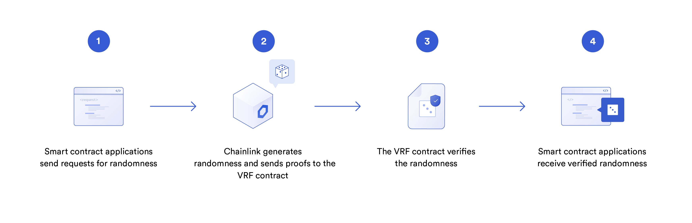
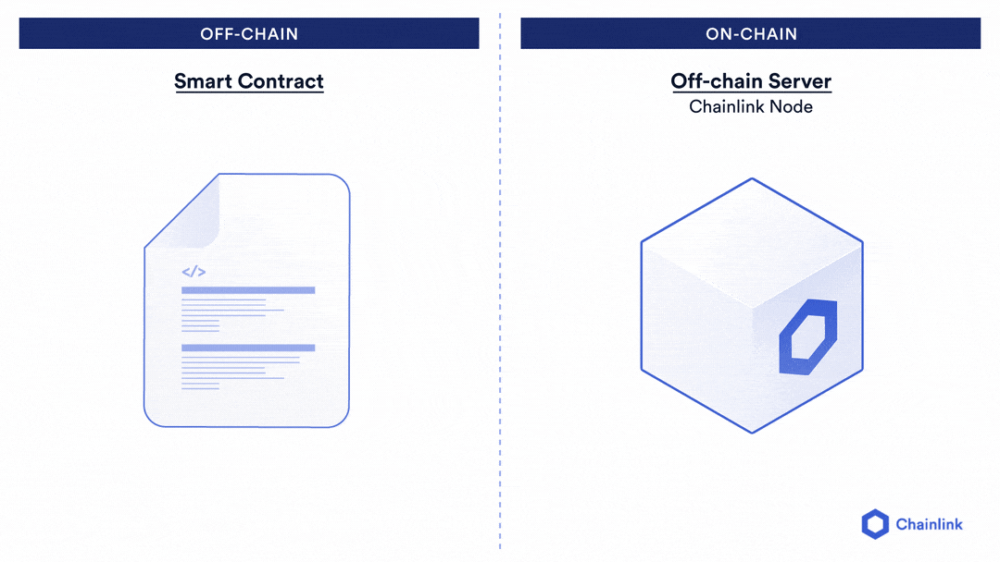

## The pseudo-random DNA

At this point in our contracts, we have been working with pseudo-randomness. Our `keccak256` was a great way to get started learning about how to create smart contracts, however they run into some major issues when creating secure smart contracts. Everything that is part of the on-chain mechanism is deterministic by design, including our hashing function. 

When we tried to get random DNA from a string, we know that the DNA we are going to get is going to be the same every single time. This means, that our randomness creation function isn't actually random! We also can't rely on someone being honest when they input a "string" into this function. 

```javascript
uint(keccak256(abi.encodePacked(_str)))
```

So how can we fix this? Well, a naive approach is to use globally available variables like `msg.sender`, `block.difficulty`, and `block.timestamp`. You might see references that try to get random numbers like so: 

```javascript
uint(keccak256(abi.encodePacked(msg.sender, block.difficulty, block.timestamp)));
```

Where they try to mix up all these globally available variables to make it harder to predict the number. However, even these numbers have predictability. `msg.sender` is known by the sender, `block.difficulty` is directly influenced by the miners, and `block.timestamp` is predictable!

So now it should be clear that everything inside the blockchain is deterministic and can lead to exploits if we try to use randomness from inside the blockchain. So how can we get randomness from outside the blockchain? You guessed it, with a Chainlink Oracle!

Let's take a look back at our good friend the zombie code, where we gave our zombie some pseudo-random DNA, and let's try to fix it, this time though, we will use the secure randomness of the <a href="https://docs.chain.link/docs/get-a-random-number/" target=_new>Chainlink Verifiable Randomness Function (Chainlink VRF)</a>. 

## Chainlink VRF

Chainlink VRF is a way to get randomness from outside the blockchain, but in a proven cryptographic manner. This is important because we always want our logic to be truly incorruptible. A naive attempt at getting randomness outside the blockchain would be to use an off-chain API call to a service that returns a random number. But if that services goes down, is bribed, hacked, or otherwise, you could potentially be getting back a corrupt random number. Chainlink VRF includes on-chain verification contracts the cryptographically prove that random number the contract is getting is really random. 




### Basic Request Model

Now, this is where we will be introduced to the <a href="https://docs.chain.link/docs/architecture-request-model/" target=_new>basic request model</a> of working with oracles. The is when a smart contract (called the "callee contract") makes a "request" to a Chainlink node, by (itself of an oracle contract, described below) emitting a specific event that a Chainlink node is subscribed to/looking for. This happens in 1 transaction. The Chainlink oracle will then process the request (be it randomness, a data request, etc), and return the data/computation back to the callee contract, or a contract that will in turn send the response to the callee contract. This "middle" contract is often referred to as the "oracle contract". This return process happens in a *second separate transaction*, so in total the basic request model is a 2 transaction event, and therefore, will take at the very minimum 2 blocks to complete. 

This 2 transaction architecture is important, because it means that brute force attacks on randomness or data requests are throttled and impossible to hack without costing the attacker insane fees in gas costs. 

To recap, the process is as such:

1. Callee contract makes a request in a transaction
   1. Callee contract or oracle contract emits an event
2. Chainlink node (Off-chain) is listening for the event, where the details of the request are logged in the event
3. In a second transaction created by the Chainlink node, it returns the data on-chain by calling a function described by the callee contract
4. In the case of the Chainlink VRF, a randomness proof is done to ensure the number is truly random

Now, similar to when we make a transaction on Ethereum or any solidity compatible blockchain, as you know, we have to pay some transaction gas. To work with oracles, we have to pay a little bit of oracle gas, also known as the [LINK or Chainlink token](https://chain.link/). The LINK token is specifically designed to work with oracles and ensure the security of the Chainlink oracle networks. Whenever we make a request following the basic request model, our contracts must be funded with a set amount of LINK, as defined by the specific oracle service that we are using (each service has different oracle gas fees). 




### Why didn't we do this with the data feeds? 

Now, the question then becomes, "Why wasn't this done with data feeds?" or "Why didn't we pay oracle gas for the data feeds?", and these are really good questions. With data feeds, an entire group of Chainlink nodes are being requested for data instead of just 1 Chainlink node (hence, it's a decentralized oracle network), however, only 1 entity has to kick off the request to the whole network. So we were able to benefit because someone else *already created the requests to the oracles* for the different kinds of data described in the data feeds. The data feeds are sponsored by a group of projects all making use of data feeds such as Aave, Compound, Synthetix, and more, and the updates to the network are being kicked off programmatically whenever there is a slight price change in the data they are reporting. Working together as a group, we can keep transaction costs down and create this collective good the whole ecosystem can benefit from! 

In summary, someone else followed a bit more advanced version of the basic request model for us with the data feeds!

### Chainlink VRF Under the Hood

The Chainlink VRF follows this basic request model, with one added benefit; since their is a cryptographic proof on-chain of the randomness of the number from a Chainlink VRF node, we are safe to work with a single Chainlink VRF node! As the technology gets better and better though, even more decentralized versions of the Chainlink VRF are being created, but luckily, we are good to work with this secure method of randomness for our smart contracts. 

We aren't going to go deep into the proofs the many researchers have done to ensure the randomness returned by Chainlink VRF nodes, but here is the basically what's happening for this magic to occur. 

In brief, a smart contract requests randomness by specifying a hash used to uniquely identify a Chainlink oracle. That has is used by the Chainlink node with it's own secret key to generate a random number, which is then returned to the contract on-chain, along with a cryptographic proof. An on-chain contract (called the `VRF Coordinator`) takes the random number along with the proof, and is verified using the oracle’s public key. Relying on the widely accepted signature and proof verification capabilities of a blockchain, this enables contracts to consume only randomness that has also been verified by the same on-chain environment running the contract itself.

You can check out the <a href="https://github.com/smartcontractkit/chainlink/blob/develop/contracts/src/v0.6/VRFCoordinator.sol" target=_new>Chainlink VRF contracts</a> to see the exact functions the system is using. 

Wow, ok, there is a lot of big brained concepts here! Let's finally dive into learning how to pull a random number into our smart contract. We can get started, by once again pulling the Chainlink VRF contract code from NPM / Github that allows us to interact with a Chainlink VRF node. We are going to `inherit` the functionality of this VRFConsumerbase contract code into our code to emit events, and define what functions the Chainlink node is going to callback (respond) to. 

## Putting it to the test

1. Import the `VRFConsumerBase.sol` Solidity version `0.6.6` from the <a href="https://github.com/smartcontractkit/chainlink" target=_new>Chainlink NPM / GitHub</a>. 


> The `VRFConsumerBase.sol` includes all the functions we need to interact with a Chainlink VRF Coordinator and node. You can always find examples in the [Chainlink Documentation.](https://docs.chain.link/docs/get-a-random-number/)

