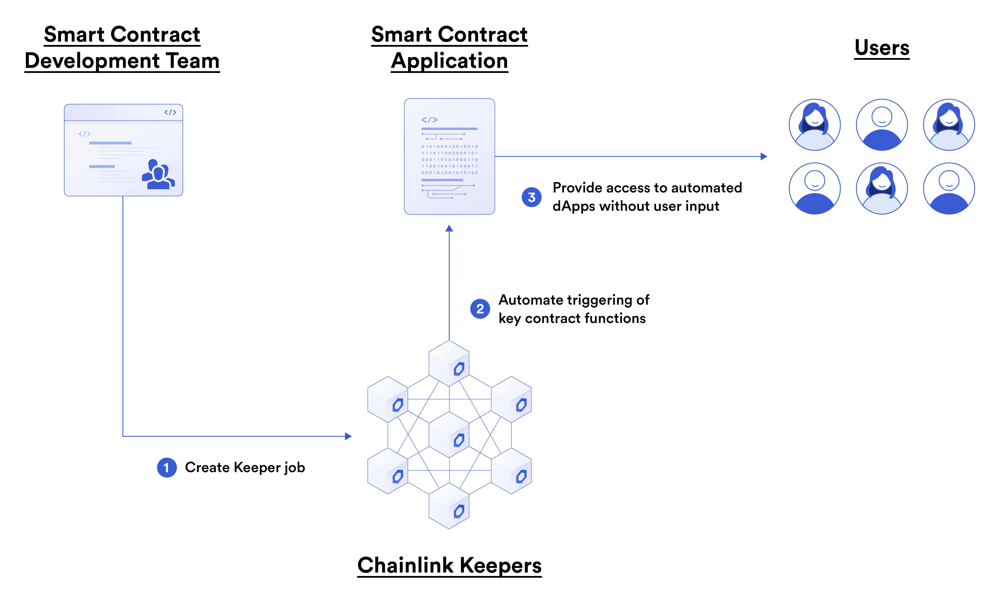

And now we've arrived at our last Chainlink service, where the burden of ensuring decentrality has already been done for us!

A major limitation of smart contracts is that they can't trigger or initiate their own functions at arbitrary times or under arbitrary conditions. State change will only occur when a transaction is initiated by another account (such as user, oracle, or contract).

To solve this problem, blockchain projects can:

1. Create highly reliable infrastructure trigger smart contract functions - this is centralized and expensive to build/maintain.
2. Outsource it to a 3rd party - often centralized and a single point of failure.
3. Use an open market solution - decentralized, but can come with complex incentive alignment, the potential for competitive bots that increase the cost of execution, and difficulties ensuring reliability
4. Use the Chainlink Keeper Network (hint hint, we are learning this one!)

Chainlink Keepers provide users with a decentralized network of nodes that are incentivized to perform all registered jobs (Upkeeps) without competing with one another, allowing you to focus on critical smart contract functionality. Meaning, you can now have **event driven decentralized automation** in your smart contracts!

An example Decentralized Finance (DeFi) use would be to detect the fulfillment of a condition that triggers the execution of trades. Tasks like this generally can't be automated on-chain and must be handled by an off-chain service due to smart contracts' inability to self-execute.

Here is an example diagram:

The basic architecture is as such:

- You deploy a keeper compatible smart contract and define the event you want to trigger off (for example, a specific time, a data feed price point hitting, an Ethereum balance threshold hit, etc)
- The contract has a function that defines what to do when this event is triggered
- You register your contract with a Keeper registry contract that a network of Chainlink nodes are watching
- You fund your registration with LINK. 
  - **IMPORTANT**: Unlike with Chainlink API Calls and Chainlink VRF, we do not fund the callee contract, we fund our registration "job" on the registration contract. You'll understand as we move through this tutorial.
- The Chainlink Keepers monitor for an event, and when one is hit, they call action you defined, and are paid LINK gas token as a reward!

Now, let's learn how to make a contract that can be triggered, automated, and event driven!
