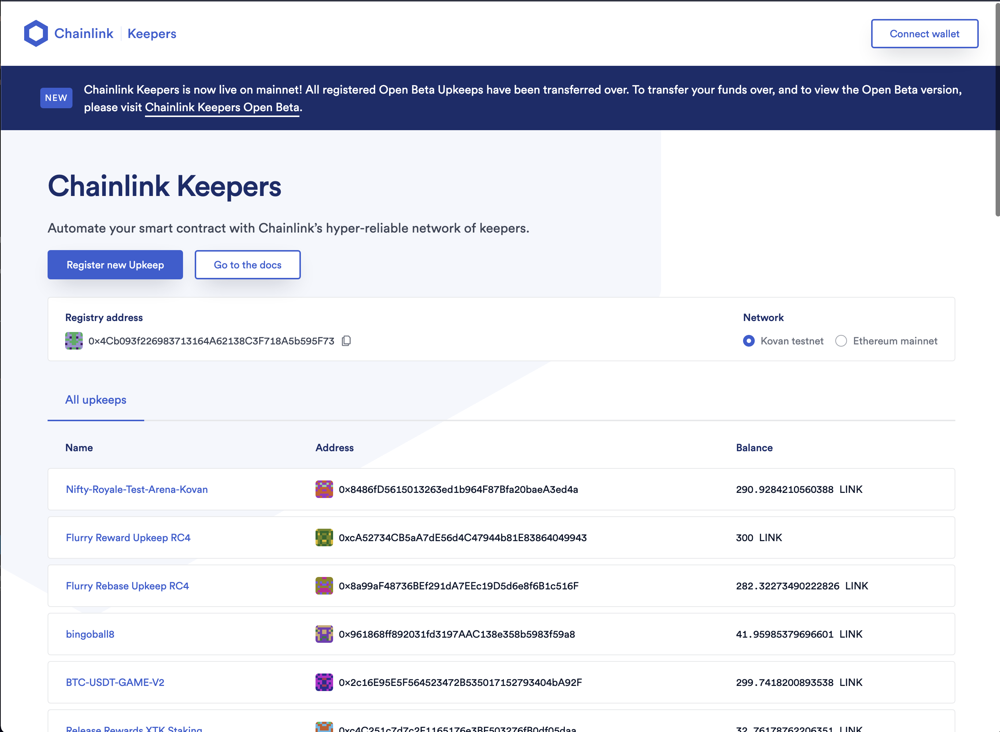

Bravo!! You did it! 

Your smart contract is now setup to be autonomous in a decentralized manner!

Now the only last step that you'd need to do, is register this with the Chainlink Keeper registry. You can do this via the [Chainlink Keepers App](https://keepers.chain.link/).

Once registered, you can interact directly with the registry contract functions (cancelUpkeep, addFunds, etc). And the Chainlink network will start working with your contract and listening for events!

We won't do that here, but if you'd like to deploy this demo LIVE to a Kovan testnet and see it all work, head over to the [Chainlink documentation and follow along to deploy a Keeper contract to the Kovan network.](https://docs.chain.link/docs/chainlink-keepers/compatible-contracts/)

You'll need to register your contract, fund it with some LINK, and then it's off to the races!!

## Putting it to the test

1. (Optional) If you like, repeat this process and deploy to the kovan network by following the [Chainlink documentation](https://docs.chain.link/docs/chainlink-keepers/compatible-contracts/). Then [register a contract](https://docs.chain.link/docs/chainlink-keepers/register-upkeep/) and see it work before your eyes!

2. Otherwise... just hit next!
